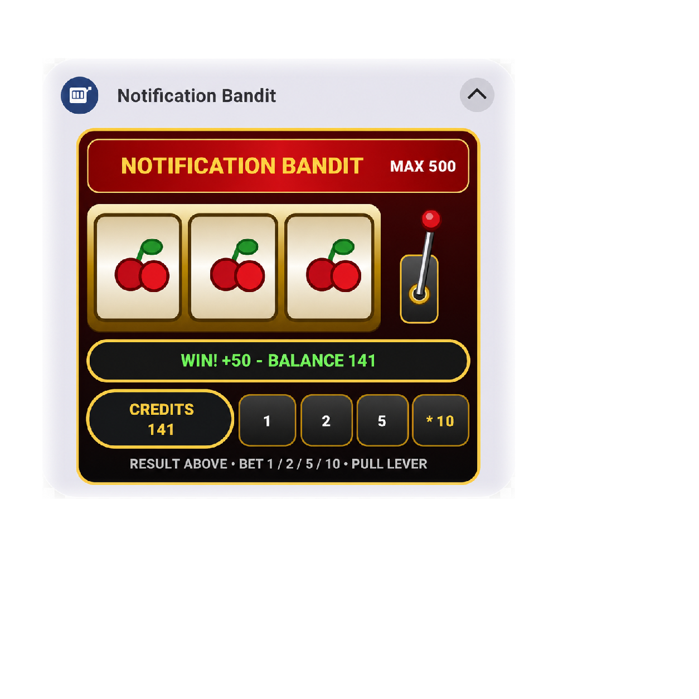

# Notification Bandit

[](https://github.com/HyperionElectronicsCo/NotificationBandit/actions/workflows/android-build.yml)

<p align="center">
  
</p>

**Notification Bandit** is a miniature one-arm-bandit game that lives inside an ongoing Android notification. Pull the lever, choose a bet and watch the reels spin without opening a full-screen game.

The game uses virtual credits only. It contains no real-money gambling, purchases, adverts or online accounts.

## Features

- Persistent foreground notification
- Three animated slot reels with staggered stopping
- Side lever and notification action to start a spin
- Selectable bets of **1, 2, 5 or 10 credits**
- Win, loss, jackpot and updated-balance display
- Saved credits, selected bet and reel state
- Restores the notification after reboot or app update
- Standard-notification fallback if an Android SystemUI rejects the custom layout
- Java-only Android source with **no lambda expressions**
- Designed for AIDE and conventional Gradle builds

## How to play

1. Install and open the app once.
2. Allow notifications when Android requests permission.
3. Expand the **Notification Bandit** notification.
4. Select a bet amount.
5. Tap the red lever or **PULL LEVER**.
6. The reels stop from left to right and the result bar shows the payout and balance.

Three matching symbols give the largest symbol-specific payout. Two matching symbols award a smaller payout. Three sevens pay the maximum jackpot multiplier.

## Build with AIDE

1. Extract the project into your AIDE projects folder.
2. Open the `NotificationBandit` project.
3. Select **Build → Clean Project**.
4. Press **Run** to build and install the debug APK.

The project uses:

- Java 8 source compatibility
- Compile SDK 34
- Target SDK 33
- Minimum SDK 21
- Android Gradle Plugin 7.4.2

## GitHub Actions build

The included workflow is located at:

```text
.github/workflows/android-build.yml
```

It automatically:

- Builds the debug APK after pushes to `master` or `main`
- Builds pull requests
- Supports manual runs from the **Actions** tab
- Uploads the installable APK as a workflow artifact
- Creates or updates a GitHub Release when a tag beginning with `v` is pushed

Example release tag:

```bash
git tag v1.1.6
git push origin v1.1.6
```

The APK can be downloaded from either the completed Actions run or the generated GitHub Release.

## Project structure

```text
NotificationBandit/
├── .github/workflows/android-build.yml
├── app/src/main/
│   ├── java/com/hyperion/notificationbandit/
│   ├── res/
│   └── AndroidManifest.xml
├── docs/notification-bandit-preview.png
├── app/build.gradle
├── build.gradle
├── gradle.properties
└── settings.gradle
```

## Android behaviour

Android may remove an ongoing notification after the app is force-stopped, notifications are disabled, or aggressive battery-management settings terminate the foreground service. Reopen the app to start the notification again.

## Package

```text
com.hyperion.notificationbandit
```
